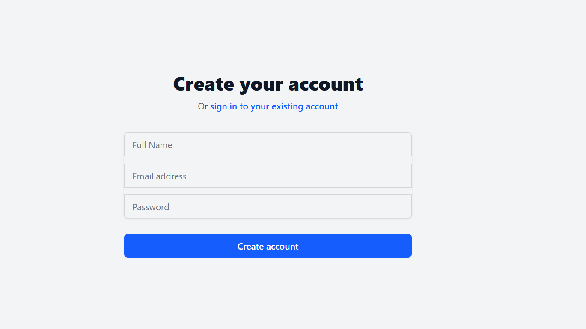
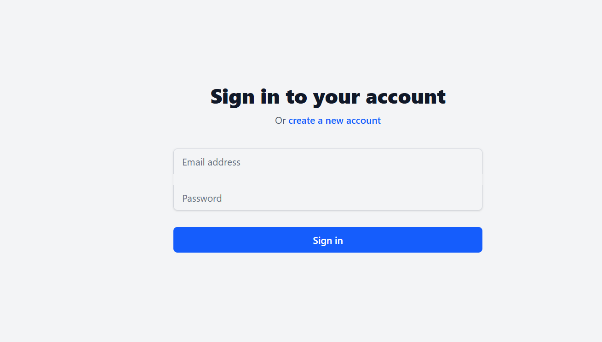
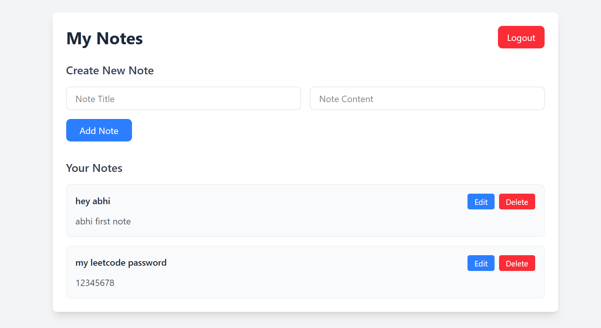

Notes App (FastAPI + React)

Simple notes app with user auth and CRUD on notes.

1) Clone the repo
git clone <your-repo-url>
cd Notes_app

2) Backend (FastAPI)

Create and activate a virtual environment, install deps, set env, then run the API.

# from project root: Notes_app/
python -m venv venv
# Windows:
venv\Scripts\activate
# macOS/Linux:
# source venv/bin/activate

pip install -r backend/requirements.txt
cp backend/env.example backend/.env   # then put real values in backend/.env
uvicorn backend.main:app --reload

backend/.env

MONGO_URL=your-mongodb-url
SECRET_KEY=your-strong-secret

API runs at: http://localhost:8000

3) Frontend (React)
# from project root: Notes_app/
cd frontend
npm install
npm run dev

App runs at: http://localhost:5173

